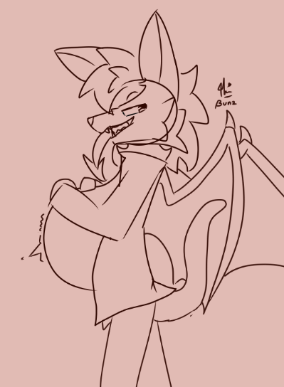
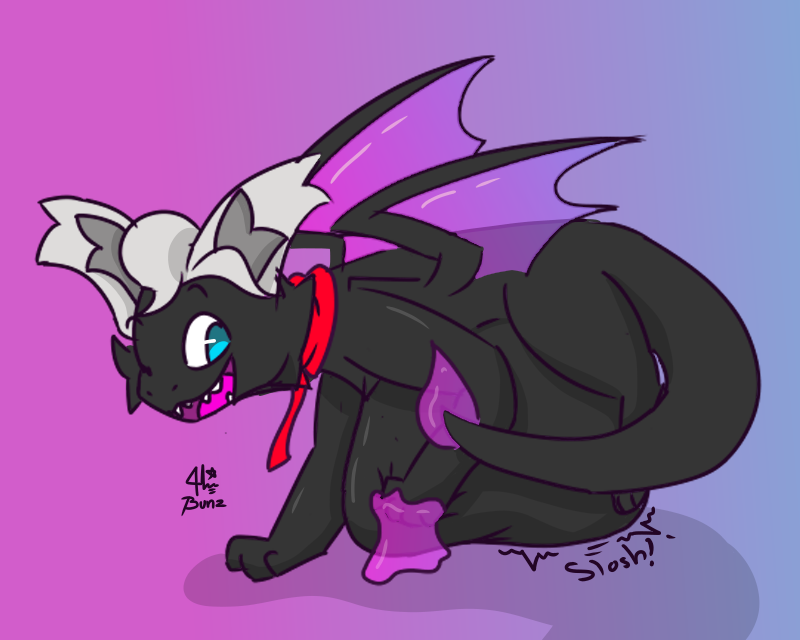

# VORE SPECIFIC COMMISSION INFORMATION

## Prices
### Mawshot/Mawplay
- Colored : $8
- Shaded : $12
### Half-body/Throat playing
- Colored : $10
- Shaded : $15
### Full-body
Note: I might not be so good at full bodies-
- Colored : $12
- Shaded : $18

# Vore References

## Additions
### Character Count
- Single : (same price as shown with notes)
- Couple : +$4
- More than that : Not yet available
### Vore Types
- Oral : Shown in the prices

## Notes
- Notes from the main README applies here!
- I currently only doing vore types that are on the list, you might need to wait for me to make any auction or YCH for other kinds of vore types (You can probably ask me to do so)
- I'm not going to draw explicit materials (blood, gore, and explicit parts of the body)
